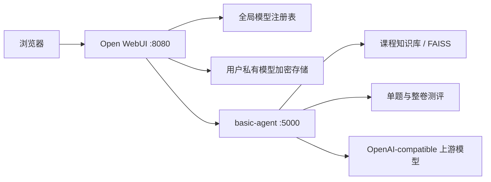

# TAgent v1 项目说明、改动说明与启动方法

版本：v1.0.0  
适用环境：Windows 10/11、Windows Server、主流 Linux 发行版

本手册中的 `<项目目录>` 指克隆或解压后的项目根目录（即包含 `start.bat` 的那一层）。

## 1. 项目说明

TAgent v1 是面向“系统建模与仿真”课程的智能教学平台，主要提供：

1. 基于课程知识库的 RAG 智能答疑。
2. 单题知识测评、答案提交和自动讲评。
3. 智能整卷生成、分页答题、暂存恢复和自动判分。
4. 管理员全局模型与用户私有模型配置。
5. 在聊天、RAG、单题和整卷场景中动态切换任意 OpenAI-compatible 模型。

浏览器只访问 Open WebUI。`basic-agent` 默认仅监听本机 `127.0.0.1:5000`，负责模型动态路由、RAG 和测评；Open WebUI 监听 `127.0.0.1:8080`，负责用户界面、登录鉴权、模型管理和同源代理。



## 2. 项目目录

```text
tagent-v1/
  basic-agent/               Flask 智能体、RAG、模型注册表、测评逻辑
  open-webui/                Open WebUI 前端与后端
  scripts/start.ps1          Windows 启动脚本（含首次初始化）
  scripts/stop.ps1           Windows 停止脚本
  scripts/start.sh           Linux 启动脚本（含首次初始化）
  scripts/stop.sh            Linux 停止脚本
  deploy/systemd/            Linux systemd 服务模板
  文档/                      项目说明、启动手册与代码手册
  日志/                      开发日志与测试方法
  start.bat                  Windows 双击启动入口
  stop.bat                   Windows 双击停止入口
  .env.runtime               本机运行密钥，首次启动自动生成，禁止提交
  .run/                      运行期 PID 文件，自动生成
  logs/runtime/              运行日志，自动生成
  VERSION                    v1.0.0
```

关键代码阅读入口：

- `basic-agent/app_factory.py`：Flask 应用装配。
- `basic-agent/model_config.py`：全局 provider 注册表和 schema v2。
- `basic-agent/model_clients.py`：动态 OpenAI-compatible 客户端。
- `basic-agent/rag_utils.py`：RAG、单题和整卷业务逻辑。
- `basic-agent/exam_schema.py`：试卷与评分结构。
- `basic-agent/exam_store.py`：两小时、最多 200 份试卷缓存与并发闸门。
- `open-webui/backend/open_webui/routers/agent.py`：用户智能体同源代理。
- `open-webui/backend/open_webui/models/agent_model_providers.py`：私有模型加密存储。
- `open-webui/src/lib/components/admin/Settings/AgentModels.svelte`：管理员模型配置页。
- `open-webui/src/lib/components/chat/Settings/Connections/AgentUserModels.svelte`：用户私有模型配置。
- `open-webui/src/lib/components/agent/ExamPanel.svelte`：整卷测评状态机。

## 3. 主要改动说明

### 3.1 固定 DeepSeek 改为通用 OpenAI-compatible 模型

原项目依赖固定的 DeepSeek 环境变量和单一模型客户端。v1 已删除 basic-agent 中全部 `DEEPSEEK_*` 运行分支，统一使用以下配置模型：

- 配置名称。
- 展示模型 ID（`served_model_id`）。
- OpenAI-compatible Base URL。
- 上游模型名。
- Bearer 或无鉴权模式。
- API Key。
- Temperature。
- 启用状态。

DeepSeek、OpenAI、通义千问、智谱、vLLM、LM Studio 等服务，只要支持标准文本 Chat Completions 协议，就按同一方式配置，不需要修改代码或重启服务。

### 3.2 全局模型与用户私有模型

- 全局模型由管理员管理，配置保存在被 Git 忽略的 `basic-agent/config/model_providers.json`。
- 私有模型由用户在 Connections 中管理，Key 使用 Fernet 加密保存在 WebUI 数据库。
- 私有模型 ID 使用 `tagent-user:<uuid>`，只对所属用户可见。
- 浏览器不提交临时 Base URL 或 Key；WebUI 完成所有权验证和解密后，通过 localhost 内部 token 调用 basic-agent。
- Key 默认掩码显示，编辑留空保留原 Key，管理员也不能查看用户完整 Key。

### 3.3 动态路由与真实流式输出

- `/v1/models` 返回所有启用的全局模型，默认模型排在首位。
- `/v1/chat/completions` 根据请求体 `model` 动态选择 provider。
- RAG、单题、整卷生成和判卷均使用相同动态路由。
- SSE 按真实上游 token/event 转发，不再伪造一次性流式响应。
- 模型客户端按 `served_model_id + updated_at` 缓存，配置变化后自动失效。

### 3.4 智能整卷

整卷固定满足以下结构：

- 填空题 4–6 道。
- 选择题 3–4 道。
- 大题 1–2 道。
- 总分严格归一为 100。

有主题时使用 MMR 检索；无主题时跨章节轮转采样。公开试卷递归移除答案、Key、Base URL 和内部 provider。客观题本地判分，主观题批量调用同一模型评审。

出卷后服务端锁定 `served_model_id`。判卷模型不一致返回 `422`；模型被删除或禁用、试卷过期时返回 `410` 并要求重新生成。缓存不保存 API Key、Base URL 或 provider envelope。

### 3.5 安全与长期质量

- 管理接口与私有内部接口使用不同 token。
- 管理 token 未配置时接口返回 `503`，不会裸奔。
- 私有 URL 默认只允许公网 HTTPS；HTTP、回环和私网必须由管理员白名单放行。
- 日志和审计递归脱敏 `api_key`、`token`、`secret`、`password` 和 Authorization。
- 请求体、消息数量、单条消息和总字符数均有限制。
- provider JSON 原子写入并带进程内锁。
- Python 与 Node 依赖使用锁文件固定。
- PID 文件记录进程身份，停止脚本不会按端口误杀未知程序。

## 4. 环境要求

### 4.1 通用要求

- Python 3.12。
- Node.js 22 LTS。
- npm。
- Git。
- uv。
- 首次初始化至少 2 GiB 可用空间；完整安装建议预留 20 GiB。

Linux 还需要 `curl`、`openssl` 和 `sha256sum`。

### 4.2 安装 uv

Windows 已安装 Python 时可执行：

```powershell
python -m pip install uv
uv --version
```

不要复制其他电脑的 `.venv` 或 `node_modules`。新电脑必须根据锁文件重新初始化。

### 4.3 Gitee 克隆后的可启动性结论

项目具备换机复现部署条件，新电脑克隆后**只需执行一条启动命令**：启动脚本会自动判断本机是否已初始化，未初始化时先按锁文件创建依赖环境、构建前端、生成本机密钥，然后再拉起服务。

因此在全新电脑上直接执行 `start.bat`（Windows）或 `./scripts/start.sh`（Linux）即可，不需要单独的初始化步骤。首次运行耗时较长，取决于网络与硬件；之后运行会跳过已完成的步骤。初始化过程不会复用开发电脑中的运行状态。

换机初始化还需要满足以下外部条件：

- 能访问 Gitee、Python 包源和 npm 包源。
- Windows 已安装 uv、Node.js 22 LTS、npm，并可获得 Python 3.12。
- Linux 已安装 Python 3.12、Node.js 22 LTS、npm、uv 和 curl。
- 首次安装至少有 2 GiB 可用空间，建议预留 20 GiB。
- `5000`、`8080` 端口未被其他程序占用。

以下内容不会上传到 Gitee，这是安全与可复现部署设计的一部分：

| 不上传内容 | 新电脑处理方式 |
|---|---|
| `.env.runtime` | 启动脚本生成该电脑独有的内部 token、Fernet Key 和 WebUI Secret |
| `basic-agent/config/model_providers.json` | 管理员登录 WebUI 后重新配置模型和 API Key |
| `open-webui/data/*.db` | Open WebUI 启动时自动创建并迁移空数据库 |
| `.venv` | 由启动脚本按 `basic-agent/uv.lock` 与 `open-webui/uv.lock` 重新创建 |
| `node_modules` | 由启动脚本根据 `package-lock.json` 执行 `npm ci` |
| `open-webui/build` | 由启动脚本执行 `npm run build` 重新生产构建 |
| `.run`、运行日志和缓存 | 启动时按本机状态重新创建 |
| `basic-agent/text_db` | 运行时根据已上传的 `basic-agent/book1.md` 重新构建知识库索引 |

课程知识源 `basic-agent/book1.md`、应用源码、数据库迁移、Windows/Linux 脚本和全部锁文件均在发布候选集中，因此忽略上述运行产物不会造成业务代码或 RAG 知识内容缺失。

当前代码与发布候选集已经通过本机完整测试和快速发布校验，但本地 `main` 仍未提交且尚未关联 Gitee。正式对外声明“其他电脑可直接按手册部署”前，还应完成一次最终验收：

1. 提交并推送 Gitee。
2. 在独立空目录或另一台干净电脑重新 `git clone`。
3. 不复制任何 `.env.runtime`、数据库、虚拟环境、`node_modules` 或构建产物。
4. 仅按照本手册执行启动、首次管理员注册和模型配置。
5. 验证聊天、RAG、单题和整卷功能后停止全部服务。

## 5. Windows 启动方法

### 5.1 启动

在项目根目录**双击 `start.bat`**，或在 PowerShell 中执行：

```powershell
cd <项目目录>
.\scripts\start.ps1
```

脚本会依次完成环境检查、依赖安装、前端构建、密钥生成，并等待 basic-agent 与 Open WebUI 健康后输出访问地址：

```text
http://127.0.0.1:8080
```

首次运行与日常运行使用同一条命令：脚本自动识别本机是否已初始化，已完成的步骤会跳过。

### 5.2 脚本执行的步骤

1. 检查 uv、Node.js（要求 `>=18.13` 且 `<=22.x`）、npm 是否就绪。
2. 检查 `5000`、`8080` 端口是否空闲；被占用时中止，且不会结束未知进程。
3. 按 `basic-agent/uv.lock` 创建 `basic-agent/.venv`。
4. 按 `open-webui/uv.lock` 创建 `open-webui/backend/.venv`（使用 `--no-install-project`，不打包 open-webui 自身）。
5. 执行 `npm ci` 与 `npm run build` 生成 `open-webui/build`。
6. 生成 `.env.runtime`（内部 token、Fernet Key、WebUI Secret）；**已存在则保留，不覆盖**。
7. 启动 basic-agent，轮询 `http://127.0.0.1:5000/health`，最长等待 300 秒。
8. 健康后启动 Open WebUI，轮询 `http://127.0.0.1:8080/health`。

运行期 PID 写入 `.run/`，标准输出与错误写入 `logs/runtime/`。

### 5.3 启动参数

```powershell
.\scripts\start.ps1                # 仅本机访问，推荐
.\scripts\start.ps1 -Lan           # WebUI 绑定 0.0.0.0，供局域网访问
.\scripts\start.ps1 -SkipBuild     # 跳过前端构建（build 已存在时）
```

| 参数 | basic-agent | Open WebUI | 用途 |
|---|---|---|---|
| 默认 | `127.0.0.1:5000` | `127.0.0.1:8080` | 本机使用 |
| `-Lan` | `127.0.0.1:5000` | `0.0.0.0:8080` | 可信局域网短期演示 |

`-Lan` 为明文 HTTP，登录 Cookie 未加密，仅适合短期演示。脚本不会修改防火墙，也不会启动或停止 Caddy/Nginx。

## 6. Linux 启动方法

```bash
cd <项目目录>
chmod +x scripts/*.sh
./scripts/start.sh
```

停止：

```bash
./scripts/stop.sh
```

参数与 Windows 对应：`--lan` 绑定 `0.0.0.0`，`--skip-build` 跳过前端构建，`--timeout <秒>` 调整等待 basic-agent 就绪的超时。

前端构建较吃内存，2 GiB 内存的云主机可能在 `npm run build` 阶段被 OOM 终止。可先在本地构建后将 `open-webui/build` 上传到服务器，再使用 `--skip-build` 启动。

### 6.1 生产服务器（systemd）

长期运行的服务器建议改用 `deploy/systemd/` 中的模板，按实际安装路径和运行用户修改后放入 `/etc/systemd/system/`：

```bash
sudo cp deploy/systemd/*.service /etc/systemd/system/
sudo systemctl daemon-reload
sudo systemctl enable --now tagent-basic-agent tagent-webui
```

模板默认路径为 `/opt/tagent-v1`，且要求两个虚拟环境已经创建、前端已经构建、`.env.runtime` 已经生成——可先执行一次 `./scripts/start.sh` 完成初始化，再用 `./scripts/stop.sh` 停止并切换到 systemd 托管。

WebUI 服务通过 `Requires` 和 `After` 依赖 basic-agent，并在启动前轮询 `http://127.0.0.1:5000/health`。公网环境只开放反向代理的 HTTPS 443，不开放 5000 和 8080。

## 7. 首次网页配置

当前交付数据库不包含账号。首次访问 WebUI 时：

1. 创建管理员账号并登录。
2. 打开“管理员设置 -> 模型配置”。
3. 新增至少一个全局 OpenAI-compatible provider。
4. 保存后打开模型选择器，选择新增模型并发送消息。

示例字段：

```text
配置名称：通义千问
展示模型名：simulation-teacher-qwen
Base URL：https://dashscope.aliyuncs.com/compatible-mode/v1
上游模型：qwen-plus
认证方式：Bearer
API Key：你的有效 Key
Temperature：0.1
启用：是
```

用户私有模型入口：

```text
个人设置 -> Connections -> Private Agent Models
```

不要把真实 Key 写入 `.env.runtime`、源码、日志、Markdown、截图或 Gitee。

## 8. 网页功能验收

建议按以下顺序检查：

1. 在原生模型选择器中切换两个不同模型，分别发送聊天消息。
2. 进入答疑智能体，确认 RAG 参考内容和真实 SSE 输出。
3. 进入单题测评，确认题目、参考资料、输入框和提交后的解析处于同一可滚动页面。
4. 进入整卷模式，确认题型数量和总分为 100。
5. 分页答题并刷新，确认暂存恢复。
6. 提交整卷，确认客观题、主观题、总分和结果分页。
7. 出卷后确认模型选择器锁定；删除该 provider 后判卷应提示重新生成。

## 9. 停止方法

Windows：双击 `stop.bat`，或执行

```powershell
.\scripts\stop.ps1
```

Linux：

```bash
./scripts/stop.sh
```

停止脚本读取 `.run/` 下的 PID 文件，并校验该进程确实属于本项目（Windows 校验可执行文件路径与进程名，Linux 校验命令行）后再终止；PID 被系统复用或进程不属于本项目时只清理 PID 文件，不会结束端口上的未知程序。

停止后脚本会检查 `5000`、`8080` 是否释放；若仍被占用会给出提示，由使用者自行核实。

## 10. 自动化测试与发布检查

服务启动过一次后，可直接用两个虚拟环境运行测试。

basic-agent：

```powershell
cd basic-agent
.\.venv\Scripts\python.exe -m pytest -p no:cacheprovider -q
```

Open WebUI 的 TAgent 相关后端测试：

```powershell
cd open-webui\backend
.\.venv\Scripts\python.exe -m pytest --import-mode=importlib `
  open_webui\test\utils\test_agent_provider_security.py `
  open_webui\test\utils\test_audit_redaction.py `
  open_webui\test\models\test_agent_model_providers.py `
  open_webui\test\apps\webui\routers\test_agent_model_providers.py `
  open_webui\test\apps\webui\routers\test_agent_user_model_providers.py `
  open_webui\test\apps\webui\routers\test_agent_proxy.py -q
```

前端严格检查与生产构建：

```powershell
cd open-webui
npm run check
npm run build
```

历史验收结果（v1.0.0 记录，供对照）：

- basic-agent：`97 passed + 7 subtests passed`。
- WebUI TAgent 后端：`36 passed`。
- 前端严格检查：`0 errors / 0 warnings`。
- 生产构建成功，npm 与 Pyodide lock 未变化。
- Gitee 候选 5032 个、约 103.1 MiB，最大单文件约 17 MiB。
- 候选中的运行密钥、数据库、provider JSON、日志和缓存数量为 0。

## 11. Gitee 同步

本地 v1 已初始化 `main` 分支，但按任务要求未自动提交、未创建标签、未关联远端。负责人审核后执行：

```powershell
git add .
git update-index --chmod=+x scripts/start.sh scripts/stop.sh
git status --short
git commit -m "release: TAgent v1.0.0"
git remote add origin <Gitee 仓库地址>
git push -u origin main
```

提交前建议确认没有误提交敏感文件，以下命令应无任何输出：

```powershell
git ls-files | Select-String -Pattern "\.env\.runtime$|model_providers\.json|\.db$|/\.venv/|node_modules/"
```

禁止上传：

- `.env.runtime`。
- `basic-agent/config/model_providers.json`。
- `open-webui/data/*.db` 和数据库备份。
- `.venv`、`node_modules`、`.svelte-kit`、`.run` 和运行日志。
- 任何真实 API Key、内部 token 或加密密钥。

## 12. 常见问题

### 12.1 缺少 `.env.runtime`

重新执行启动脚本即可自动生成。不要手工从其他电脑复制包含密钥的运行文件。若需重置密钥，删除该文件后重新启动；注意重置 `AGENT_PROVIDER_ENCRYPTION_KEY` 会导致已保存的用户私有模型 Key 无法解密，需要重新填写。

### 12.2 提示生产构建不存在

删除 `open-webui/build` 后重新执行启动脚本，或在 `open-webui` 中使用 Node.js 22 运行 `npm run build`。

### 12.3 端口被占用

启动脚本会拒绝继续且不会杀死未知进程。先执行停止脚本；若端口仍被占用，使用 `Get-NetTCPConnection`（Windows）或 `ss -ltnp`（Linux）确认占用者，人工判断后再处理。

### 12.3.1 依赖下载缓慢或失败

国内网络可先配置镜像后重新启动：

```powershell
$env:UV_DEFAULT_INDEX = "https://mirrors.aliyun.com/pypi/simple/"
npm config set registry https://registry.npmmirror.com
```

### 12.4 模型不出现在选择器

确认 provider 已启用、Base URL 与上游模型名正确，并刷新模型列表。私有模型还必须属于当前登录用户。

### 12.5 上游鉴权失败

在网页配置页更新 Key。编辑时 Key 留空表示保留原值；不要在终端中输出 Key。

### 12.6 首次 RAG 启动较慢

首次运行会加载嵌入模型并构建向量索引。启动脚本最长等待 basic-agent 300 秒，健康后才启动 WebUI。

## 13. 相关文档

- `README.md`：项目简介与快速开始。
- `文档/代码手册/`：核心代码阅读顺序与二次开发说明。
- `deploy/systemd/`：Linux 生产环境服务模板。
- `日志/开发日志.md`：按日期记录的代码改动。
- `日志/测试方法.md`：完整测试操作手册。

> 说明：`日志/` 目录为按日期记录的历史过程，其中提到的早期脚本名称保留原样，不随本次启动方式调整而修改。
