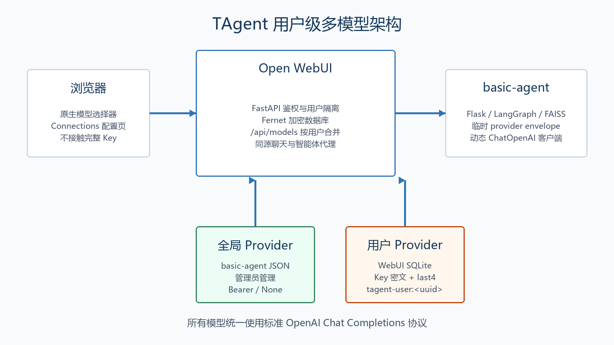
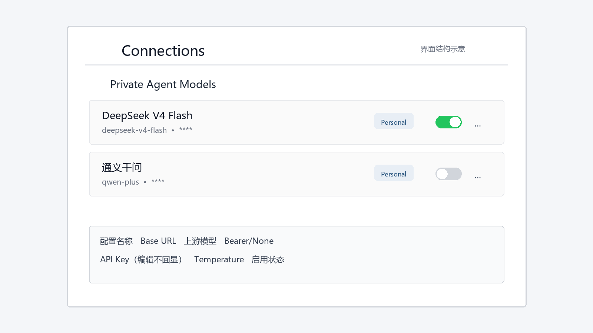
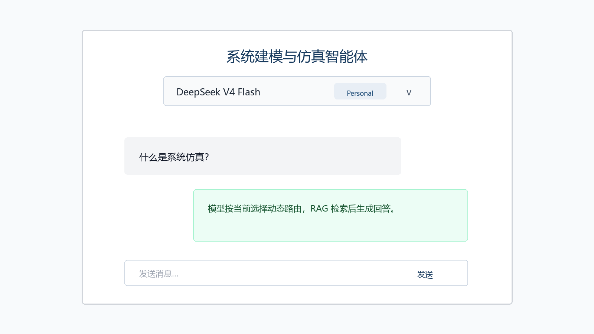

# TAgent 多模型改造项目汇报

**汇报日期：** 2026-07-14  
**项目目标：** 跑通 REPO 内的系统建模与仿真智能体，并将固定 DeepSeek 改造成适配任意标准 OpenAI Chat Completions 协议的模型服务。

## 1. 项目结论

本次工作完成了从“固定 DeepSeek 单模型”到“管理员全局模型 + 用户私有模型”的两级配置体系。用户可在 Open WebUI 原有 Connections 设置页中维护自己的 Base URL、上游模型、认证方式、API Key 和温度，并在原生模型选择器中切换；聊天、RAG、出题和判题均按请求中的模型 ID 动态路由。

私有 Key 使用独立 Fernet 密钥加密后写入 WebUI 数据库，浏览器、其他用户和管理员治理接口均看不到完整值。basic-agent 只在经过内部 token 认证的 localhost 请求中临时接收 provider，不将私有 Key 写入 JSON 或日志。



## 2. 原始代码的问题

原始 Git HEAD 的 `basic-agent/main.py` 在进程启动时直接创建 `LangChainRAGSimulator`，固定使用：

```python
llm_model="deepseek-chat"
llm_base_url="https://api.deepseek.com/v1"
llm_api_key=os.getenv("DEEPSEEK_API_KEY")
```

原始 `rag_utils.py` 在构造函数中固定创建 `self.llm`；`state_graph.py` 还在 import 阶段清空 Key、创建 DeepSeek 客户端并发起请求。这导致：

1. 更换模型必须改代码或 `.env` 并重启服务。
2. 多个用户无法选择不同的 Base URL、模型和 Key。
3. import 即执行会让无效 Key 直接阻断启动。
4. 固定 LangGraph 检查点可能让并发请求共享状态。
5. 原流式响应是把最终文本按行切分，不是真实上游 token 流。
6. Key、错误堆栈和 provider 信息缺少统一的安全边界。

## 3. 跑通原项目与固定环境

项目由 `basic-agent` 与 `open-webui` 两部分组成。部署时固定 Python 3.12、Node.js 22、Open WebUI v0.8.12，并使用 `uv.lock`、`package-lock.json` 复现依赖。

标准启动流程：

```powershell
cd D:\Development\SRP\tagent-package
.\scripts\init.ps1
.\scripts\start.ps1
.\scripts\health.ps1
```

初始化脚本会准备两个 Python 3.12 环境、Node 22 依赖、WebUI 会话密钥、私有 provider 加密密钥和内部通道 token。启动脚本记录 PID、轮询健康接口，并将 WebUI 数据目录统一到 `open-webui/data`。本次迁移前分别备份了 `open-webui/data/webui.db` 与 `open-webui/backend/data/webui.db`。

## 4. 核心改造

### 4.1 basic-agent 动态路由

basic-agent 被拆分为 Flask app factory、Blueprint、provider 注册表、模型客户端工厂、RAG 服务和统一错误层。

- 全局 provider 使用 schema v2 JSON，支持 Bearer 与无鉴权模式。
- `/v1/models` 仅返回启用模型，默认模型优先。
- `/v1/chat/completions`、`/rag/query`、`/quiz/generate`、`/quiz/review` 均按 `model` 选 provider。
- 模型客户端按 `served_model_id + updated_at` 缓存，配置变更后失效。
- 向量库线程安全延迟初始化，请求状态彼此独立。
- SSE 直接转发 LangChain 上游 token 流。
- 出题和判题使用 JSON/Pydantic 解析，不依赖工具调用。

### 4.2 管理员全局模型

管理员配置继续保存在被 Git 忽略的 `basic-agent/config/model_providers.json`。WebUI 管理代理要求管理员身份，并通过 `X-Agent-Admin-Token` 调用 basic-agent；接口只返回 `api_key_masked` 与 `has_api_key`。

### 4.3 用户私有模型

Alembic 新增两张表：

| 表 | 作用 |
|---|---|
| `agent_model_provider` | 保存用户 ID、显示名称、Base URL、上游模型、认证模式、Key 密文、末四位、温度和状态 |
| `agent_model_provider_default` | 保存每个用户自己的默认模型 ID |

私有模型内部 ID 为 `tagent-user:<uuid>`。`/api/models` 在响应当前用户时才合并私有模型，不写入 `app.state.MODELS` 共享缓存，因此同名配置不会跨用户冲突或泄露。



### 4.4 聊天与智能体链路

主聊天识别 `tagent-user:` 后执行所有权检查，从数据库解密 Key，复核 URL 安全策略，再通过独立内部 token 调用 basic-agent。浏览器只发送模型 ID 和消息，不能传临时 Base URL 或 Key。



## 5. 安全设计

1. 私有 Key 使用独立 Fernet 密钥加密，编辑留空保留原 Key，切换无鉴权时删除密文。
2. 提供事务化密钥轮换脚本；任一密文不可解密时整批回滚。
3. 默认仅允许公网 HTTPS；拒绝 URL 内嵌凭据、私网、环回、链路本地和元数据地址。
4. 运行前再次解析 Base URL，缩短 DNS 变化造成的 SSRF 风险窗口。
5. HTTP、本地模型和私网地址只能由管理员主机/CIDR 白名单放行。
6. 审计日志递归脱敏 `api_key`、token、secret、password 和 authorization。
7. basic-agent 默认只绑定 `127.0.0.1`；管理通道和私有模型通道使用不同 token。
8. API、日志、Markdown、DOCX 与截图材料均不包含完整 Key。

## 6. 测试结果

| 项目 | 结果 | 说明 |
|---|---:|---|
| basic-agent pytest | 通过 | `34 passed`，另有 `7 subtests passed` |
| WebUI TAgent 后端测试 | 通过 | `31 passed`，覆盖加密、轮换、双用户隔离、CRUD、SSRF、审计脱敏与代理 |
| 前端严格检查 | 通过 | `svelte-check found 0 errors and 0 warnings` |
| Vitest | 通过 | 当前上游未配置前端测试文件，`passWithNoTests` 返回 0 |
| Node 22 生产构建 | 通过 | 构建前后 `package-lock.json`、Pyodide lock 哈希不变 |
| fake OpenAI provider | 通过 | 非流式、SSE、RAG、出题、判题全部通过 |
| WebUI 私有主聊天 | 通过 | fake provider 非流式与 SSE 均通过 |
| simulation-teacher 首次响应 | 通过 | 预热后首个 SSE 数据约 `1.024` 秒，完整回答约 `1.952` 秒 |
| GPT 模型出题与参考内容 | 通过 | 出题约 `5.79` 秒；参考内容公式边界、页码标记和 LaTeX 环境检查通过 |
| 真实 DeepSeek V4 Flash | 未通过 | 已按通用 provider 加密保存；现有本地凭据被上游统一返回 401 |
| 浏览器自动交互 | 未执行 | 本机浏览器安全策略阻止继续访问 127.0.0.1；未绕过该限制 |

真实测试还发现并修复了一个重要问题：Open WebUI 原异常捕获曾把私有主聊天的上游 401 包装成 HTTP 200 空响应。修复后，聊天、SSE、RAG、出题和判题均一致返回 401 与稳定错误码。

## 7. 运行稳定性收口

后续页面复测暴露了四类影响实际使用的问题：首次 `simulation-teacher` 请求长时间空白、生产构建更新后停留在 OI 启动画面、参考内容混入分页残片或截断公式，以及 GPT 生成的 LaTeX 在测评页按普通文本显示。

本轮在不改变整体 UI 风格的前提下完成以下处理：

1. 生产启动时预热知识切分、中文向量模型和 FAISS 索引，健康检查通过后首条问答不再承担 RAG 冷启动成本。
2. 题干、参考内容、评语和参考答案复用 Open WebUI 的 Markdown/KaTeX 渲染组件，修复裸 LaTeX 与公式定界符显示问题。
3. 增加参考文本规范化和安全截断，清理页码残片、孤立数值行、空格公式、未闭合 `$$` 与未闭合 LaTeX 环境。
4. 为出题设置受控上下文和 20 秒上游超时；超时时生成基于参考资料的本地单题，避免页面长期停留在骨架屏。
5. WebUI 的 HTML 响应禁用缓存，避免浏览器继续加载失效的哈希静态文件而卡在启动画面。

## 8. 最终成果

- 固定 DeepSeek 逻辑已移除，DeepSeek 仅作为普通 OpenAI-compatible provider。
- 管理员可维护全局模型，用户可维护自己的加密私有模型。
- 原生模型选择器可切换全局和 Personal 模型，UI 风格与导航保持不变。
- 聊天、RAG、出题、判题使用同一动态路由机制。
- 环境、迁移、启动、健康检查、停止、fake provider 与真实 smoke test 均有脚本和手册。
- 项目代码手册给出了完整请求链路、核心类、调试入口与推荐阅读顺序。
- 最终已执行统一停止脚本，`5000`、`8080`、`5173`、`9100` 均无监听，交付状态不保留项目后台进程。

## 9. 后续建议

1. 轮换曾出现在聊天记录中的 DeepSeek Key，并在 Connections 页面更新；当前本地凭据返回 401。
2. 生产跨主机部署时，将 WebUI 到 basic-agent 的内部通道升级为 HTTPS/mTLS。
3. provider 数量增长后，将本地 JSON 全局注册表迁移到数据库，并接入集中式密钥管理。
4. 为 Connections 新组件补充独立 Vitest/组件测试，并在允许 localhost 的浏览器环境补录真实配置页与模型切换截图。
