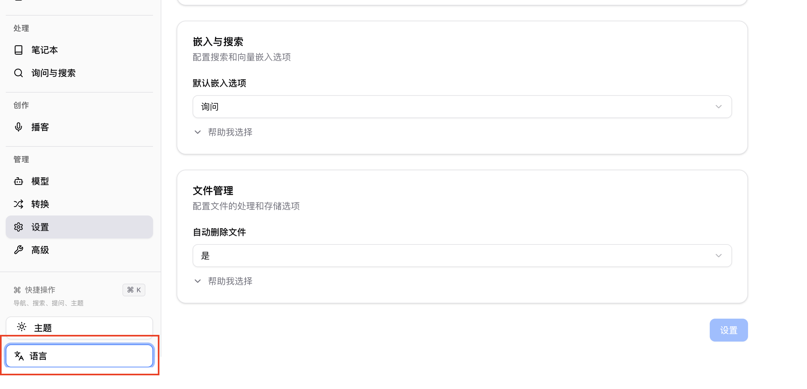
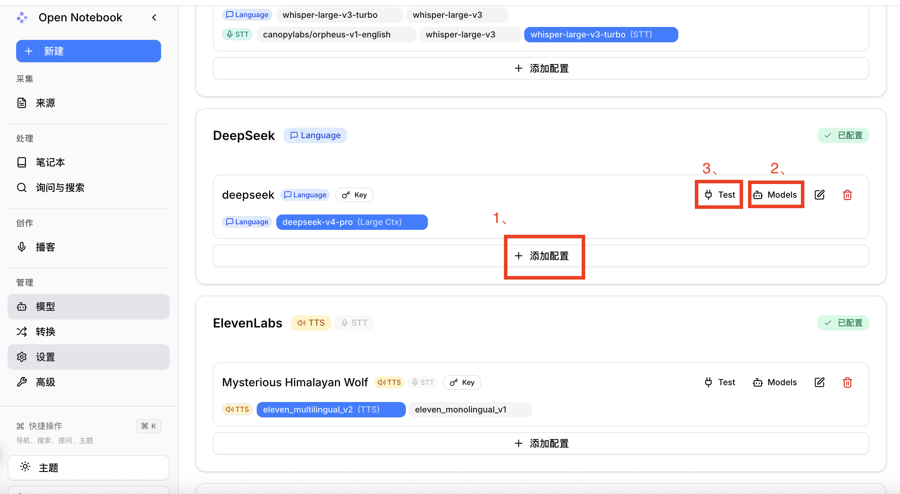
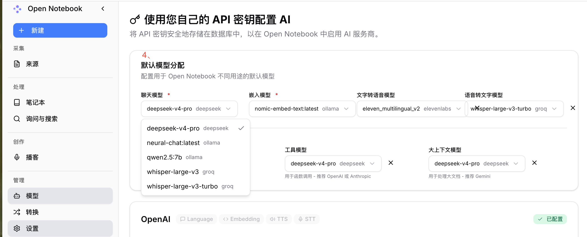
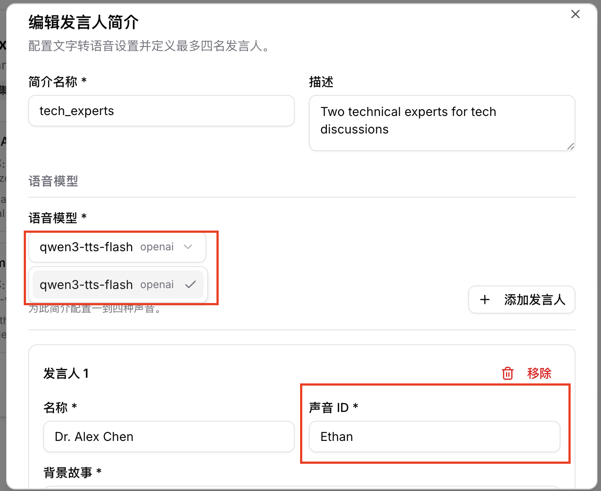

## 项目结构

```text
open-notebook-setup/          # Gitee 仓库
├── README.md                 # 核心：中文「如何跑通」
├── docker-compose.yml        # 从上游拷贝或微调
├── aliyun-tts-bridge/        # 阿里云百炼平台接入
|   ├── app.py
|   └── Dockerfile
└── docs/                     # 截图、常见问题
    ├── set-language.png
    ├── first.png
    ├── podcast-edit.png
    ├── podcast-speakers.png
    ├── podcast-ui.png
    └── second.png

```

## 快速跑通

### 前提条件

已安装[Docker Desktop](https://www.docker.com/products/docker-desktop/)

### 第一步：获取 docker-compose.yml

**选项 A：** 直接下载

```bash
curl -o docker-compose.yml https://raw.githubusercontent.com/lfnovo/open-notebook/main/docker-compose.yml
```

**选项 B：** 手动创建文件 将其复制到一个名为 `docker-compose.yml` 的新文件中：

```yaml
services:
  surrealdb:
    image: surrealdb/surrealdb:v2
    # Credentials default to root:root for a zero-config local setup. Before
    # exposing this instance to a network, set SURREAL_USER / SURREAL_PASSWORD
    # in a .env file (see .env.example) — they are applied here and to the
    # open_notebook service below, so the two always stay in sync.
    # List (exec) form so each interpolated value stays a single argument —
    # a password containing spaces would otherwise be split into several.
    command: ["start", "--log", "info", "--user", "${SURREAL_USER:-root}", "--pass", "${SURREAL_PASSWORD:-root}", "rocksdb:/mydata/mydatabase.db"]
    user: root  # Required for bind mounts on Linux
    ports:
      # Bound to localhost only: the open_notebook service reaches this over
      # the internal compose network regardless, so the host port is purely
      # for local debugging (e.g. Surrealist, `surreal sql`). Exposing this
      # on 0.0.0.0 would let anyone who can reach the host connect with the
      # default root:root credentials.
      - "127.0.0.1:8000:8000"
    volumes:
      - ./surreal_data:/mydata
    environment:
      - SURREAL_EXPERIMENTAL_GRAPHQL=true
    restart: always
    pull_policy: always

  open_notebook:
    image: lfnovo/open_notebook:v1-latest
    ports:
      - "8502:8502"  # Web UI
      - "5055:5055"  # REST API
    environment:
      # REQUIRED: Change this to your own secret string
      # This encrypts your API keys in the database
      - OPEN_NOTEBOOK_ENCRYPTION_KEY=change-me-to-a-secret-string

      # Database connection. SURREAL_USER / SURREAL_PASSWORD default to root:root
      # for local use; override them in a .env file before exposing the instance
      # (the same values configure the surrealdb service above).
      - SURREAL_URL=ws://surrealdb:8000/rpc
      - SURREAL_USER=${SURREAL_USER:-root}
      - SURREAL_PASSWORD=${SURREAL_PASSWORD:-root}
      - SURREAL_NAMESPACE=open_notebook
      - SURREAL_DATABASE=open_notebook
    volumes:
      - ./notebook_data:/app/data
    depends_on:
      - surrealdb
    restart: always
    pull_policy: always
```

### 第二步：设置您的加密密钥

编辑 `docker-compose.yml` 并更改此行：

```yaml
- OPEN_NOTEBOOK_ENCRYPTION_KEY=change-me-to-a-secret-string
```

改为任何秘密值（例如 `my-super-secret-key-123`）

### 第三步：启动服务

```bash
docker compose up -d
```

等待 15-20 秒，然后打开：**[http://localhost:8502](http://localhost:8502/)**

> **拉取失败？** 配置 Docker 镜像加速（国内用户推荐）

如果执行 `docker pull` 或 `docker compose pull` 时速度慢、超时或拉取失败，可以配置 Docker Hub 镜像加速器。

1. 打开 Docker Engine

打开：

```text
Docker Desktop
→ Settings
→ Docker Engine
```

2. 添加镜像源

在配置中添加 `registry-mirrors`：

```json
{
  "registry-mirrors": [
    "https://你的阿里云专属地址.mirror.aliyuncs.com",
    "https://docker.m.daocloud.io",
    "https://docker.nju.edu.cn"
  ]
}
```

> 推荐使用自己的 **阿里云** 或 **华为云** 专属镜像加速地址，公共镜像源仅作为备用。

3. 保存配置

点击：

```text
Apply & Restart
```

等待 Docker Desktop 重启即可。

4. 测试

```bash
docker pull hello-world
```

如果能够正常拉取镜像，说明配置成功。


### 第四步：配置 AI 提供商

1. 将语言设置成中文

   
2. 转到 **Models** 并选择您的提供商（OpenAI、Anthropic、Google 等）
3. 点击  **Add Configuration**
4. 根据需要粘贴您的 API 密钥和其他信息，然后点击 **Add Configuration**
5. 点击 **Test** 测试连接

    
6. 点击 **Sync Models** 并勾选要包含的模型
    
    
7. 在 **Default Model Assignments** 下，点击 **Auto-Assign Defaults** 或手动指定哪些模型用于什么用途

已完成！您可以开始创建第一个笔记本了。

> **需要一个 API 密钥？** 从以下地址获取： [OpenAI](https://platform.openai.com/api-keys) · [Anthropic](https://console.anthropic.com/) · [Google](https://aistudio.google.com/) · [Groq](https://console.groq.com/) (免费层)· [DeepSeek](https://platform.deepseek.com/)

## 推荐AI模型
### 一、配置 Ollama 本地模型（推荐）

Ollama 可以让 Open Notebook 在本地运行 AI 模型。

优点：

- 免费
- 无需 API Key
- 数据保存在本机
- 不依赖网络


Open Notebook 推荐两个模型：

| 模型类型 | 用途 | 推荐模型 |
|-|-|-|
| Chat Model | 聊天、总结、分析 | qwen2.5 |
| Embedding Model | 文档向量化、知识库搜索 | mxbai-embed-large:latest |

---

**1. 安装 Ollama**


访问：

https://ollama.com/download


下载对应系统版本并安装。


安装完成后打开命令行：

Windows：

```
Win + R
```

输入：

```
cmd
```


检查：

```bash
ollama --version
```


显示版本号：

```
ollama version x.x.x
```

表示安装成功。


---

**2. 下载 Chat 模型**


推荐：

```bash
ollama pull qwen2.5:7b
```


说明：

- `7b` 适合普通电脑
- 内存 16GB 左右即可运行


查看模型：

```bash
ollama list
```


示例：

```
NAME

qwen2.5:7b
```


---

**3. 下载 Embedding 模型**


知识库功能需要 Embedding 模型。


安装：

```bash
ollama pull mxbai-embed-large
```


检查：

```bash
ollama list
```


应该包含：

```
qwen2.5:7b

mxbai-embed-large:latest
```


---

**4. 测试 Ollama**


测试聊天：

```bash
ollama run qwen2.5:7b
```


输入：

```
你好
```


如果返回回答：

说明模型运行正常。


退出：

```
Ctrl + C
```


---

**5. 配置 Open Notebook**


打开：

```
http://localhost:8502
```


进入：

```
管理
→ Models
→ Add Configuration
```


选择：

```
Ollama
```


填写：

```
Base URL:

http://host.docker.internal:11434
```


注意：

不要填写：

```
http://localhost:11434
```

---

**6. 注册模型**


点击：

```
Sync Models
```


添加：

Language 模型

```
qwen2.5:7b
```


用途：

```
Chat Model
```


用于：

- AI 对话
- 文档总结
- 内容分析


Embedding 模型


添加：

```
mxbai-embed-large:latest
```


用途：

```
Embedding Model
```


用于：

- PDF 文档解析
- 知识库搜索
- RAG 检索


### 二、接入阿里云百炼 Qwen3-TTS 教程(推荐)

本教程用于将阿里云百炼 Qwen3-TTS 语音服务接入 Open Notebook，实现 AI 播客自动语音生成。

最终架构：

```
Open Notebook
        |
        ↓
aliyun-tts-bridge
        |
        ↓
阿里云百炼 Qwen3-TTS
        |
        ↓
生成语音
```

支持：

- Open Notebook
- Ollama 本地大模型
- 阿里云百炼 Qwen3-TTS
- Docker Compose 部署
- OpenAI Compatible TTS 接口


---

**配置阿里云百炼 TTS 语音服务**


1. 创建阿里云百炼 API Key


进入：

```
阿里云百炼控制台
```


创建 API Key。


获得：

```
sk-xxxxxxxxxxxxxxxx
```


注意：

不要将真实 API Key 上传到公开仓库。


2. 测试阿里云百炼 TTS


创建文件：

```
tts.json
```


内容：

```json
{
  "model": "qwen3-tts-flash",
  "input": {
    "text": "你好，这是阿里云百炼语音测试",
    "voice": "Cherry"
  }
}
```


PowerShell 执行：

```powershell
curl.exe https://dashscope.aliyuncs.com/api/v1/services/aigc/multimodal-generation/generation `
-H "Authorization: Bearer 你的API_KEY" `
-H "Content-Type: application/json" `
-d "@tts.json"
```


成功返回：

```json
{
 "output":{
    "audio":{
       "url":"https://xxxx.wav"
    }
 }
}
```


说明：

- API Key 正常
- 百炼 TTS 服务正常


---

**创建 aliyun-tts-bridge 服务**


1. 创建目录


进入项目：

```powershell
cd open-notebook-setup
```


创建：

```
aliyun-tts-bridge
```


最终目录结构：

```
open-notebook-setup
├── README.md
├── docker-compose.yml
└── aliyun-tts-bridge
    ├── app.py
    └── Dockerfile
```

2. 创建 app.py


文件：

```
aliyun-tts-bridge/app.py
```


内容：

```python
from fastapi import FastAPI, Response
import requests
import os


app = FastAPI()


API_KEY = os.getenv("DASHSCOPE_API_KEY")


@app.get("/v1/models")
def models():

    return {
        "object":"list",
        "data":[
            {
                "id":"qwen3-tts-flash",
                "object":"model"
            }
        ]
    }


@app.post("/v1/audio/speech")
def speech(data:dict):

    text = data.get("input")


    payload = {
        "model":"qwen3-tts-flash",
        "input":{
            "text":text,
            "voice":"Cherry"
        }
    }


    response = requests.post(

        "https://dashscope.aliyuncs.com/api/v1/services/aigc/multimodal-generation/generation",

        headers={
            "Authorization":f"Bearer {API_KEY}",
            "Content-Type":"application/json"
        },

        json=payload
    )


    result = response.json()


    audio_url = result["output"]["audio"]["url"]


    audio = requests.get(audio_url).content


    return Response(
        content=audio,
        media_type="audio/wav"
    )
```


---

**创建 Dockerfile**


文件：

```
aliyun-tts-bridge/Dockerfile
```


注意：

文件名必须：

```
Dockerfile
```


不要：

```
Dockerfile.txt
```


内容：

```dockerfile
FROM python:3.12


WORKDIR /app


COPY app.py .


RUN pip install fastapi uvicorn requests


CMD ["uvicorn","app:app","--host","0.0.0.0","--port","8000"]
```

---

**修改 docker-compose.yml**


打开：

```
open-notebook-setup/docker-compose.yml
```


在最下面增加： **注意需要把 aliyun-tts-bridge 和 surrealdb、open_notebook 放在同一级**

```yaml
  aliyun-tts-bridge:
    build:
      context: ./aliyun-tts-bridge
      dockerfile: Dockerfile

    container_name: aliyun-tts-bridge
    restart: unless-stopped

    environment:
      DASHSCOPE_API_KEY: "你的阿里云API密钥"
      TTS_MODEL: "cosyvoice-v1"

    ports:
      - "8001:8000"
```

启动服务


进入项目目录：

```powershell
cd open-notebook-setup
```


第一次启动：


```powershell
docker compose up -d --build
```


以后启动：

```powershell
docker compose up -d
```

---

**测试 TTS Bridge**


1. 测试模型接口


windows执行：

```powershell
curl.exe http://localhost:8001/v1/models
```

mac执行：
```bash
curl  http://localhost:8001/v1/models
```

返回：

```json
{
 "object":"list",
 "data":[
   {
    "id":"qwen3-tts-flash"
   }
 ]
}
```


说明：

aliyun-tts-bridge 运行成功。

2. 测试生成语音


执行：

window:

```powershell
curl.exe http://localhost:8001/v1/audio/speech `
-H "Content-Type: application/json" `
-d "{\"model\":\"qwen3-tts-flash\",\"input\":\"你好，这是测试\"}" `
--output test.wav
```

mac:
```
curl http://localhost:8001/v1/audio/speech \
  -H "Content-Type: application/json" \
  -d '{"model":"qwen3-tts-flash","input":"你好，这是测试"}' \
```

生成：

```
test.wav
```


即可播放。


---

**Open Notebook 配置**


打开：

```
http://localhost:8502
```


进入：

```
模型
OpenAI Compatible
```


配置 TTS。


Base URL

填写：

```
http://host.docker.internal:8001/v1
```


Model

填写：

```
qwen3-tts-flash
```


API Key

填写：

```
local
```


原因：

真实 API Key 已经由 Docker Compose 注入：

```
DASHSCOPE_API_KEY
```


Open Notebook 不需要保存真实 Key。

---

**Docker 服务管理**


1. 查看服务

```powershell
docker compose ps
```


2. 查看日志

```powershell
docker compose logs -f aliyun-tts-bridge
```


3. 停止服务

```powershell
docker compose down
```


4. 重新启动

```powershell
docker compose up -d
```

5. 修改代码后重新部署


修改：

```
aliyun-tts-bridge/app.py
```


执行：

```powershell
docker compose down

docker compose up -d --build
```

---

## 博客页面配置

1、进入博客页面


2、点击编辑，配置好所有模块




声音ID去自己选择的语音模型api文档找，qwen3-tts-flash的网址是https://help.aliyun.com/zh/model-studio/qwen-tts-voice-list

---

> **从源码安装？** 从以下地址获取教程： [教程](https://github.com/lfnovo/open-notebook/blob/main/docs/1-INSTALLATION/from-source.md) 


